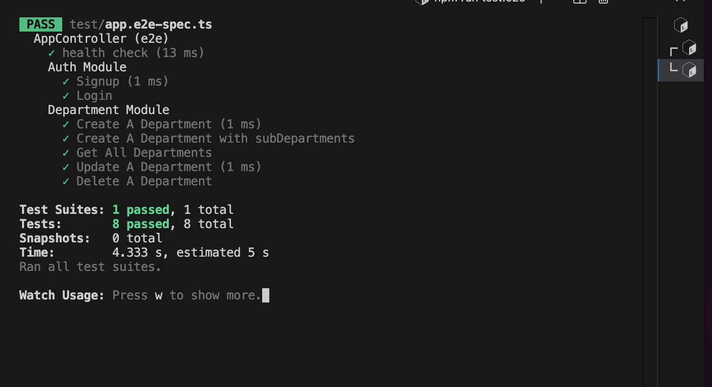

# WholeSale Hill

This application is created with Nestjs x Typeorm x Graphql


N.B: Live URL: [Graphql Playground Here](https://wholesale-hill.onrender.com/graphql)


## Tests
The application was developed using  Test driven Development (TDD) using pactum x supertest x jest,  the tests were created from the project requirements

All test passed as at when writing this documentation, the output of running `npm run test:e2e` should be similar to the image below:




## Example Operations

```

<!-- Check if API is working fine -->
query {
  healthcheck
   }

<!-- Signup a new user -->

mutation {
            signup(user_input: {
                username: ${faker.person.firstName},
                password: ${faker.internet.password}
              }){
                status
                message
              }
        }


<!-- Login for an existing user -->

 mutation {
              login(user_input: {
                username: ${faker.person.firstName},
                password: ${faker.internet.password}
              }){
                status
                message
                token
              }
            }

<!-- Delete a department -->

 mutation {
  deleteDepartment(id:1){
     status
     message
   }
 }

<!-- Create a department -->

mutation {
  createDepartment(
    input: {name: "Engineering"}
  ) {
    id
    name
  }
}

<!-- Update a department -->


 mutation {
   updateDepartment(id: 2, input: {
     name: "Human resource (HR)"
   }){
     status
     message
   }
 }


<!-- Get all department -->


 query {
   getDepartments{
     name
     id
     childDepartments{
      name
       id
    }
  }
}


```
